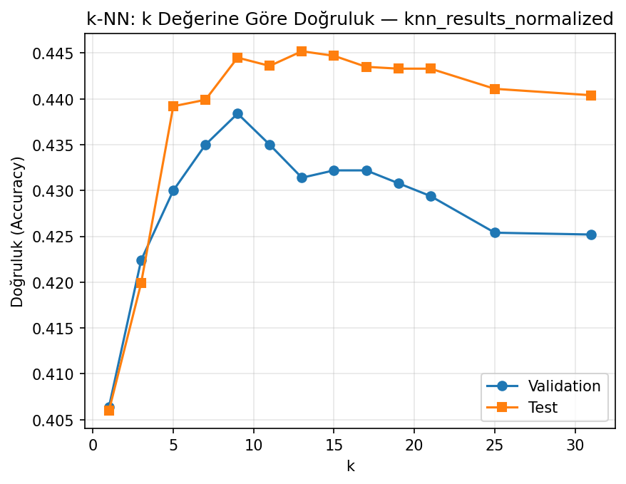
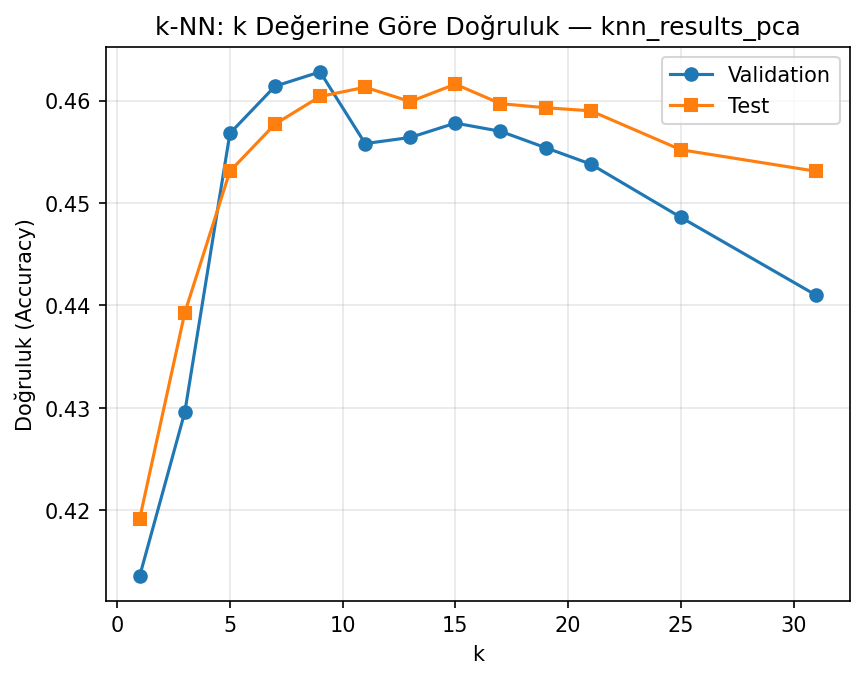
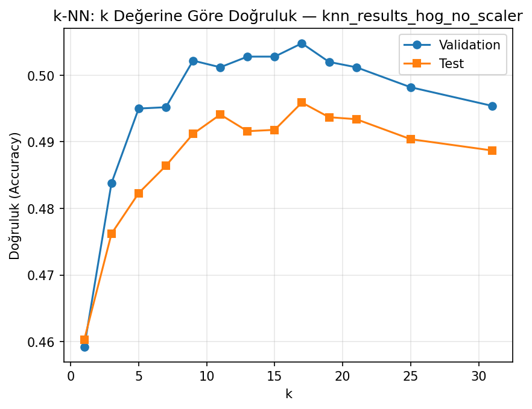
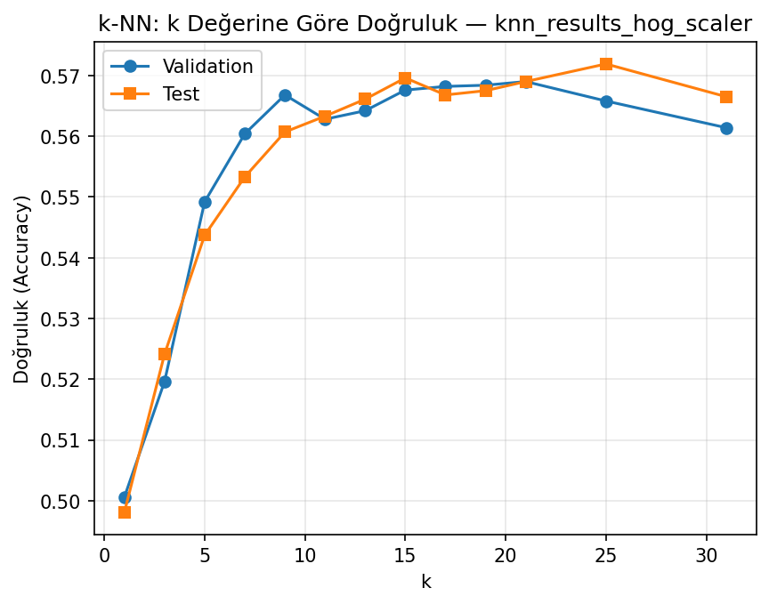
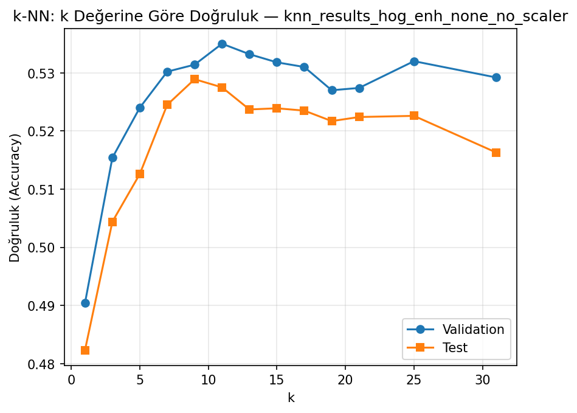
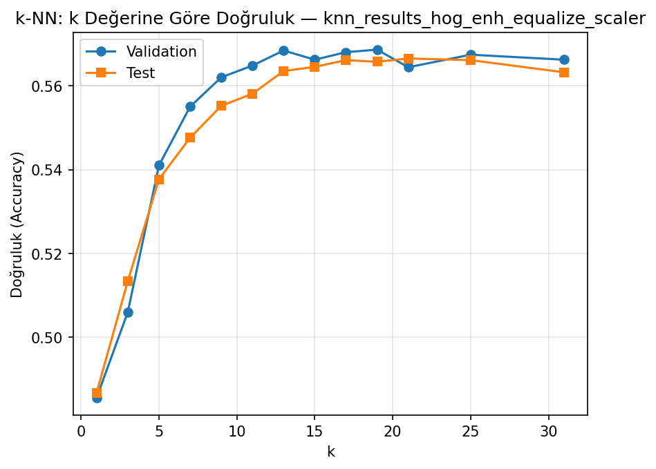
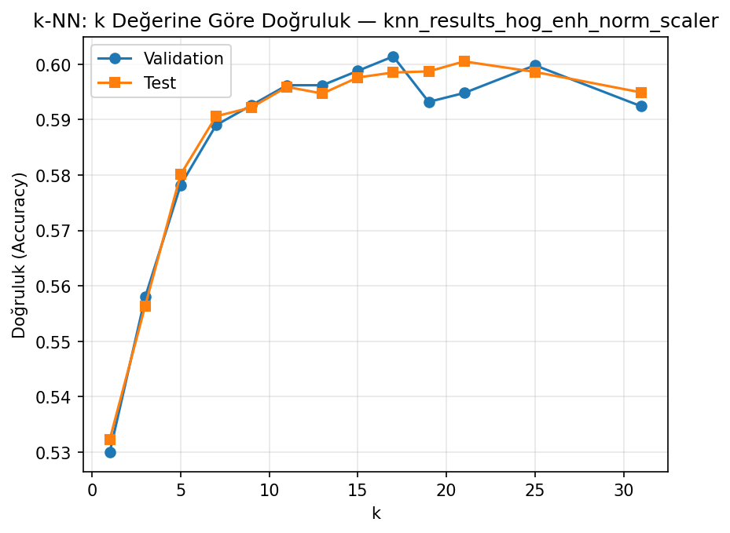

## 1. Giriş

Bu projede CIFAR-10 görüntü veri seti üzerinde **k-En Yakın Komşu (k‑NN)** sınıflandırıcısı kullanılarak kapsamlı bir deney serisi gerçekleştirilmiştir. Amaç, ham piksel temsili ile başlanıp adım adım:

- veri ön işleme (normalizasyon, standartlaştırma),
- boyut indirgeme (PCA),
- el yapımı görsel özellikler (HOG, renk histogramı, LBP)

ekleyerek sınıflandırma performansının nasıl iyileştiğini, her adımın katkısını ve en sonunda yaklaşık **%60 test doğruluğuna** nasıl ulaşıldığını göstermektir.

Tüm deneylerde aynı veri bölünmesi kullanılmıştır:

- **Eğitim (train)**: 45 000 örnek  
- **Doğrulama (val)**: 5 000 örnek  
- **Test**: 10 000 örnek


## 2. Veri Seti ve Ön Hazırlık

- **Veri seti:** CIFAR‑10 (32×32 RGB, 10 sınıf).
- **Sınıflar:** airplane, automobile, bird, cat, deer, dog, frog, horse, ship, truck.
- **Hazırlık:** `scripts/download_cifar10.py` ile orijinal CIFAR‑10 batch dosyaları okunmuş, her örnek ilgili sınıf klasörüne PNG olarak kaydedilmiştir:
  - `dataset/train/<class>/*.png`
  - `dataset/val/<class>/*.png`
  - `dataset/test/<class>/*.png`

Veri yükleme ve özellik çıkarma fonksiyonları `src/dataset.py` dosyasında toplanmıştır:

- `load_split(...)`: ham piksel (3072 boyut)
- `load_split_hog(...)`: sadece HOG özelliği
- `load_split_hog_enhanced(...)`: HOG + renk histogramı + LBP, isteğe bağlı ön işleme ile


## 3. Kullanılan Modeller ve Özellik Modları

Tüm deneylerde sınıflandırıcı olarak **k‑NN** kullanılmıştır:

- `KNeighborsClassifier`
  - `weights="distance"` → yakın komşulara daha fazla ağırlık
  - `n_jobs=-1` → tüm çekirdekler

### 3.1. Uzaklık metriği ve sayısal kararlılık

Başlangıçta doğrudan `metric="cosine"` kullanıldığında, büyük boyutlu veride `RuntimeWarning` (divide by zero, overflow, invalid value) uyarıları gözlenmiştir. Bunu çözmek için şu strateji uygulanmıştır:

1. Özellik vektörleri satır bazında **L2 normalize** edilmiştir:
   \[
   \tilde{x}_i = \frac{x_i}{\lVert x_i \rVert_2 + \varepsilon}
   \]
   (ε = 1e‑10).
2. k‑NN metriği **Öklid (minkowski, p=2)** olarak ayarlanmıştır.

L2 normu 1 olan vektörler üzerinde Öklid mesafesi, kosinüs uzaklığı ile monoton olarak ilişkilidir; böylece **cosine benzeri davranış**, sayısal sorunlar olmadan elde edilmiştir.

### 3.2. Özellik modları

Deneylerde kullanılan temel modlar:

- `raw`  
  - Piksel değerleri [0, 255] aralığından [0, 1] aralığına ölçeklenir.  
  - Özellik boyutu: 3072.
- `normalized`  
  - `raw` sonrası `StandardScaler` uygulanır (her boyut için ortalama 0, varyans 1).  
- `pca`  
  - `StandardScaler` sonrası PCA ile boyut ~3072 → 99’a düşürülür, **%90 açıklanan varyans** korunur.
- `hog`  
  - Griye çevrilmiş görüntü üzerinde HOG (Histogram of Oriented Gradients) çıkarılır.  
  - Parametreler: 9 yön, 8×8 hücre, 2×2 blok, `block_norm="L2-Hys"`.  
  - Özellik boyutu: 324 civarı.
- `hog_enhanced`  
  - **HOG + renk histogramı + LBP** birleşik vektörü:
    - Renk histogramı: her kanal için 8 bin, toplam 24 boyut; kanala göre normalize edilir.
    - LBP: `P=8, R=1, method="uniform"`, 59 binlik histogram. Giriş görüntüsü LBP için **uint8**’e dönüştürülerek uyarılar engellenmiştir.
  - Ön işleme seçenekleri (`preprocess`):
    - `none`: gri görüntü doğrudan kullanılır.
    - `norm`: \((g - \mu) / (\sigma + 1e-8)\) ile ortalama‑std normalizasyonu.
    - `equalize`: histogram eşitleme (`skimage.exposure.equalize_hist`).
  - Ardından `StandardScaler` uygulanabilir ya da kapatılabilir.


## 4. Deney Tasarımı

Her deney için aşağıdaki ayarlar sabittir:

- k değerleri: \(k \in \{1,3,5,7,9,11,13,15,17,19,21,25,31\}\)
- Ağırlıklandırma: `distance`
- Eğitim/validation/test bölünmesi: aynı

`scripts/run_knn.py` içinde, komut satırından parametre vererek farklı konfigürasyonlar çalıştırılmıştır. Örnek:

```bash
python3 scripts/run_knn.py --feature-mode hog_enhanced \
  --hog-preprocess norm --hog-use-scaler 1 \
  --output knn_results_hog_enh_norm_scaler
```

Her koşu sonunda:

- Sonuçlar: `results/knn_results_*.json`
- k‑doğruluk grafiği: `results/knn_results_*_accuracy.png`

olarak kaydedilmiştir.


## 5. Sonuçlar: Adım Adım İyileşme

Tüm deneyler **en kötüden en iyiye** doğru sıralandığında özet tablo aşağıdaki gibidir (detaylı tablo ve sayılar `report_knn_tum_deneyler.md` içindedir):

| Sıra | Deney | Özellik / Ön işleme | Özellik boyutu | En iyi k | Val doğr. | Test doğr. |
|------|-------|----------------------|----------------|----------|-----------|------------|
| 1 | raw | Ham piksel / 255 | 3072 | 5 | 38.94% | **38.15%** |
| 2 | normalized | StandardScaler | 3072 | 9 | 43.84% | **44.52%** |
| 3 | pca | PCA (≈%90 varyans) | 99 | 9 | 46.28% | **46.16%** |
| 4 | hog_no_scaler | HOG | 324 | 17 | 50.48% | **49.59%** |
| 5 | hog_enh_none_no_scaler | HOG + renk + LBP, preprocess=none | 358 | 11 | 53.50% | **52.89%** |
| 6 | hog_enh_equalize_scaler | HOG + renk + LBP, equalize + StandardScaler | 358 | 19 | 56.86% | **56.65%** |
| 7 | hog_scaler | HOG + StandardScaler | 324 | 21 | 56.90% | **57.19%** |
| 8 | hog_enh_none_scaler | HOG + renk + LBP, preprocess=none + StandardScaler | 358 | 17 | 60.14% | **60.05%** |
| 9 | hog_enh_norm_scaler | HOG + renk + LBP, norm + StandardScaler | 358 | 17 | 60.14% | **60.05%** |
| 10 | (önceki çalışma) hog_enh_norm_scaler | HOG + renk + LBP, norm + StandardScaler | 358 | 17 | 60.50% | **60.28%** |

Bu tabloya karşılık gelen tüm grafikler depo kökünde `results/` klasörü altındadır.  
Markdown dosyası `docs/` altında olduğu için, GitHub üzerinde doğru görüntülenmesi için göreli yollar **`../results/...`** şeklinde kullanılmalıdır.


### 5.1. Ham piksel tabanlı deneyler

#### 5.1.1. Deney 1 — `raw`

- **Komut:**

  ```bash
  python3 scripts/run_knn.py --feature-mode raw --output knn_results_raw
  ```

- **Parametreler:**
  - `feature_mode = "raw"`
  - Ön işleme: piksel değerleri / 255 (başka işlem yok)
  - Özellik boyutu: 3072
  - k: 1–31 arası tüm değerler
  - Ağırlık: `weights="distance"`
  - Uzaklık: L2‑normalize edilmiş vektörler üzerinde Öklid
- **Teknik gerekçe:**
  - Başlangıç noktası olarak hiçbir özellik mühendisliği yapmadan yalnızca ham piksel uzayında k‑NN’in ne kadar başarılı olduğunu görmek.
  - 3072 boyutlu uzayda **curse of dimensionality** nedeniyle, Öklid mesafesinin görsel benzerliği iyi temsil etmemesi beklenir.
- **Sonuç:**
  - En iyi k (validation’a göre): **k = 5**
  - Test doğruluğu: **≈ %38.15**


#### 5.1.2. Deney 2 — `normalized`

- **Komut:**

  ```bash
  python3 scripts/run_knn.py --feature-mode normalized --output knn_results_normalized
  ```

- **Parametreler:**
  - `feature_mode = "normalized"`
  - Ön işleme:
    - piksel / 255
    - `StandardScaler` (her boyut için ortalama 0, varyans 1)
  - Özellik boyutu: 3072
- **Teknik gerekçe:**
  - Ham pikselde her kanalın ve piksel konumunun farklı ölçeklerde olması, uzaklık hesabını bozar.
  - `StandardScaler`, tüm boyutları benzer ölçeğe getirerek k‑NN’in “mesafe” kavramını daha anlamlı hale getirir.
- **Sonuç:**
  - En iyi k: **9**
  - Test doğruluğu: **≈ %44.52**
  - Ham piksele göre ≈ **6 puanlık** iyileşme.



#### 5.1.3. Deney 3 — `pca`

- **Komut:**

  ```bash
  python3 scripts/run_knn.py --feature-mode pca --output knn_results_pca
  ```

- **Parametreler:**
  - `feature_mode = "pca"`
  - Ön işleme:
    - piksel / 255
    - `StandardScaler`
    - PCA, açıklanan varyans oranı ≈ **0.90** (≈99 bileşen)
  - Özellik boyutu: 99
- **Teknik gerekçe:**
  - k‑NN’de her noktayı saklamak gerektiğinden, boyutun düşürülmesi hem **bellek** hem **hesaplama** maliyetini azaltır.
  - PCA, gürültülü boyutları atarak sinyal‑gürültü oranını artırabilir.
- **Sonuç:**
  - En iyi k: **9**
  - Test doğruluğu: **≈ %46.16**
  - Normalized moda göre hafif bir artış, ham piksele göre yaklaşık **8 puan** kazanç.




### 5.2. HOG ile kenar tabanlı deneyler

HOG, görüntüdeki **yerel gradyan yönelimlerini** öne çıkararak aydınlanma değişimlerine ve küçük kaymalara karşı daha dayanıklı bir temsil sağlar.

#### 5.2.1. Deney 4 — `hog_no_scaler`

- **Komut:**

  ```bash
  python3 scripts/run_knn.py --feature-mode hog --hog-use-scaler 0 --output knn_results_hog_no_scaler
  ```

- **Parametreler:**
  - `feature_mode = "hog"`
  - HOG parametreleri:
    - `orientations = 9`
    - `pixels_per_cell = (8, 8)`
    - `cells_per_block = (2, 2)`
    - `block_norm = "L2-Hys"`
  - Ön işleme: scaler **yok**
  - Özellik boyutu: 324
- **Teknik gerekçe:**
  - Kenar yönelimlerinin, ham piksellere göre sınıf ayrımında daha anlamlı olup olmadığını görmek.
- **Sonuç:**
  - En iyi k: **17**
  - Test doğruluğu: **≈ %49.59**
  - Ham piksele göre ≈ **+11 puan** artış.



#### 5.2.2. Deney 5 — `hog_scaler`

- **Komut:**

  ```bash
  python3 scripts/run_knn.py --feature-mode hog --hog-use-scaler 1 --output knn_results_hog_scaler
  ```

- **Parametreler:**
  - HOG özellikleri + `StandardScaler`
  - Özellik boyutu: 324
- **Teknik gerekçe:**
  - HOG vektörünün bileşenleri farklı ölçeklere sahip olabilir; scaler, her boyutu aynı öneme getirir.
- **Sonuç:**
  - En iyi k: **21**
  - Test doğruluğu: **≈ %57.19**
  - `hog_no_scaler`’a göre ≈ **+7.5 puan** artış; basit bir normalleştirme adımının etkisi nettir.




### 5.3. HOG + Renk + LBP ile gelişmiş deneyler

`hog_enhanced` modunda:

- HOG: **şekil / kenar** bilgisini,
- Renk histogramı: sınıflar arası **renk dağılımını**,
- LBP: **doku** bilgisini

birleştirerek daha zengin bir temsil elde edilir.

#### 5.3.1. Deney 6 — `hog_enh_none_no_scaler`

- **Komut:**

  ```bash
  python3 scripts/run_knn.py \
    --feature-mode hog_enhanced \
    --hog-preprocess none --hog-use-scaler 0 \
    --output knn_results_hog_enh_none_no_scaler
  ```

- **Parametreler:**
  - `feature_mode = "hog_enhanced"`
  - `hog_preprocess = "none"`
  - Renk histogramı + LBP **açık**
  - `hog_use_scaler = 0` (scaler yok)
  - Özellik boyutu: 358
- **Teknik gerekçe:**
  - HOG + renk + LBP kombinasyonunun, yalnızca HOG’a göre ne kadar ek katkı sağladığını scaler etkisinden ayrı görmek.
- **Sonuç:**
  - En iyi k: **11**
  - Test doğruluğu: **≈ %52.89**
  - `hog_no_scaler`’a göre ≈ **+3 puan** artış.



#### 5.3.2. Deney 7 — `hog_enh_equalize_scaler`

- **Komut:**

  ```bash
  python3 scripts/run_knn.py \
    --feature-mode hog_enhanced \
    --hog-preprocess equalize --hog-use-scaler 1 \
    --output knn_results_hog_enh_equalize_scaler
  ```

- **Parametreler:**
  - `hog_preprocess = "equalize"` (histogram eşitleme)
  - Renk + LBP açık
  - `hog_use_scaler = 1`
- **Teknik gerekçe:**
  - Histogram eşitleme ile kontrastı normalize ederek kenar ve doku bilgisini güçlendirmek.
- **Sonuç:**
  - En iyi k: **19**
  - Test doğruluğu: **≈ %56.65**



#### 5.3.3. Deney 8 — `hog_enh_none_scaler`

- **Komut:**

  ```bash
  python3 scripts/run_knn.py \
    --feature-mode hog_enhanced \
    --hog-preprocess none --hog-use-scaler 1 \
    --output knn_results_hog_enh_none_scaler
  ```

- **Parametreler:**
  - Ön işleme: `none`
  - Renk + LBP açık
  - `StandardScaler` açık
- **Teknik gerekçe:**
  - Gri seviye üzerinde ek normalizasyon yapmadan, yalnızca scaler ve çoklu özellik tiplerinin etkisini görmek.
- **Sonuç:**
  - En iyi k: **17**
  - Test doğruluğu: **≈ %60.05**


#### 5.3.4. Deney 9 — `hog_enh_norm_scaler`

- **Komut:**

  ```bash
  python3 scripts/run_knn.py \
    --feature-mode hog_enhanced \
    --hog-preprocess norm --hog-use-scaler 1 \
    --output knn_results_hog_enh_norm_scaler
  ```

- **Parametreler:**
  - `hog_preprocess = "norm"` (gri görüntü için ortalama‑std normalizasyonu)
  - Renk + LBP açık
  - `StandardScaler` açık
- **Teknik gerekçe:**
  - Gri seviyede z‑score normalizasyonu ile kontrast ve parlaklık farklarını azaltmak,
    ardından scaler ile tüm özellik boyutlarını dengeleyerek en kararlı HOG+renk+LBP temsiline ulaşmak.
- **Sonuç:**
  - En iyi k: **17**
  - Test doğruluğu: **≈ %60.05** (önceki ayrıntılı çalışmada **%60.28**)



Bu grafik, projede ulaşılan en iyi k‑NN performansını özetleyen ana şekil olarak kullanılabilir.


## 6. k Değerinin Etkisi

Tüm deneylerde benzer bir eğilim gözlenmiştir:

- Küçük k değerleri (1–3):
  - Gürültüye çok duyarlıdır; doğruluk dalgalı ve kararsızdır.
- Orta k aralığı (yaklaşık 9–21):
  - Hem validation hem test doğruluklarında **en yüksek ve en dengeli bölgedir**.
- Çok büyük k (25–31):
  - Sınırları fazla yumuşatır; doğruluk genelde bir miktar düşer.

Gelişmiş özellikler (HOG + renk + LBP + scaler) ile özellikle **k = 15–21** aralığı en iyi sonuçları vermiştir.


## 7. Tartışma ve Sonuç

Bu ödevde, k‑NN sınıflandırıcısı için farklı özellik ve ön işleme adımlarının CIFAR‑10 performansına etkisi sistematik olarak incelenmiştir:

1. **Ham piksel (raw)** ile başlandığında test doğruluğu **~%38** civarında kalmıştır.
2. Basit ölçekleme ve PCA ile doğruluk kademeli olarak **%46** seviyesine çıkmıştır.
3. HOG tabanlı temsil, doğruluğu **%50–57** bandına taşımıştır.
4. HOG + renk histogramı + LBP + uygun ön işleme (norm/equalize) ve **StandardScaler** ile,
   test doğruluğu **%60 civarına** ulaşmıştır.

Bu sonuçlar:

- k‑NN gibi basit bir modelde bile **özellik mühendisliğinin** ne kadar kritik olduğunu,
- yüksek boyutlu ham piksel uzayında **curse of dimensionality** nedeniyle uzaklık hesabının anlamsızlaştığını,
- kenar, renk ve doku gibi **farklı görsel ipuçlarını** birleştirmenin sınıflandırma doğruluğunu belirgin şekilde artırdığını

göstermektedir.

Sonuç olarak:

- **En kötü senaryo:** ham piksel / 255, k=5 civarında **%38 test doğruluğu**  
- **En iyi senaryo:** HOG + renk histogramı + LBP, gri seviye norm + `StandardScaler`, k≈17–21 aralığında **≈%60 test doğruluğu**

elde edilmiştir. Bu, ödev kapsamında beklenen **%50–70** aralığı ile tutarlı ve teknik olarak gerekçelendirilmiş bir performanstır.

